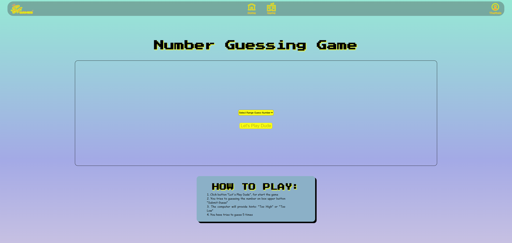
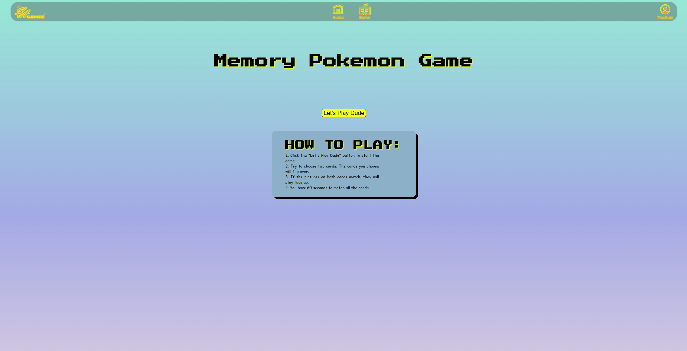
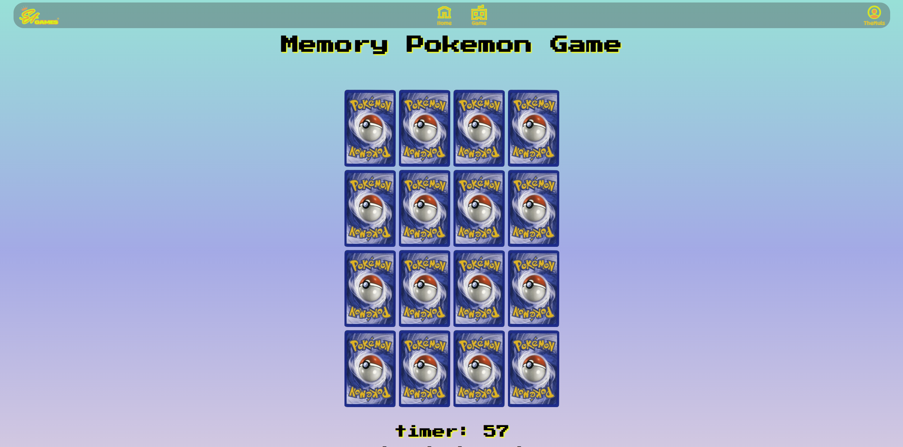
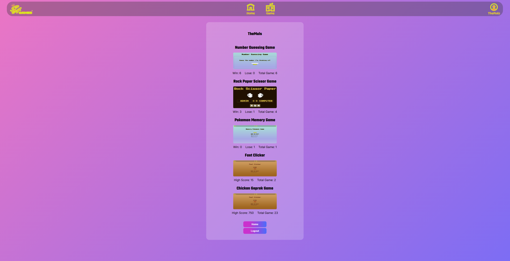

# Project Milestone 2

## 📌 Overview
Sagames is a fun, interactive web-based game hub where users can enjoy a variety of simple yet addictive JavaScript games. Designed for casual players, Sagames is all about quick gameplay, clean design, and a nostalgic dose of classic mini-games — all accessible right from your browser.<br>
Deploy Website:<br>
Visit the SaGame site: [SAgames website](https://revou-fsse-feb25.github.io/milestone-2-Salthof28/) <br>

## 🚀 Features 
- **Home Page**: Introduction to sagames with a clean, visually appealing design. Overview of available games with navigation links to each game page. Responsive layout for an optimal experience across devices.


- **Game Pages**: <br>
Rock Paper Scissors <br>
A timeless classic! Play against the computer in a quick match of luck and strategy. Choose your move and see if you can outsmart the computer.

Number Guessing Game <br>
Can you guess the correct number? The computer picks a random number. Your job is to find it with as few attempts as possible. Perfect for logic and luck lovers.

Fast Clicker Game <br>
Test your clicking speed and aim to beat your high score before time runs out. It's simple, and fun!

Pokemon Memory Game <br>
Train your brain with this Pokémon-themed memory card matching game. Flip cards, find matching pairs, and try to complete the board in short time.


Chicken Geprek Game <br>
Play as a chicken and dodge falling objects or you'll end up as chicken geprek!

- **User Authentication**: Register and login system using localStorage.


- **User Profiles**: Track individual game progress (wins, losses, highscores) based on login. If you want to save your track progress, I recomend login before playing the game. In profile user you can monitor your performance across all games.



## 💡 Technologies Used
- **HTML5** - Structure of the landing page and individual game pages.
- **CSS3** - Styling for visual appeal and responsive design.
- **JavaScript (Vanilla)** - Game logic, DOM manipulation, event handling, authentication, and local data handling.
- **Form Validation** – Custom client-side validation to ensure data integrity during registration/login.
- **LocalStorage Integration** - Stores user sessions and game states locally for fast access and offline capability.

## 📜 How to Use
1. clone this repository:
```sh
git clone https://github.com/revou-fsse-feb25/milestone-2-Salthof28.git
```
2. Open index.html in a browser to view the website.


## Author
:bulb: Salman Althof